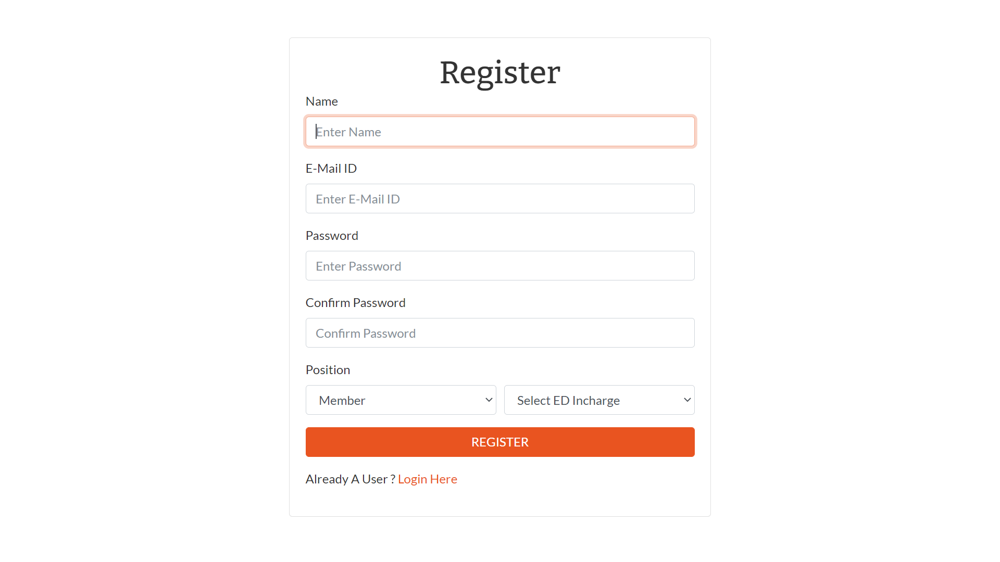
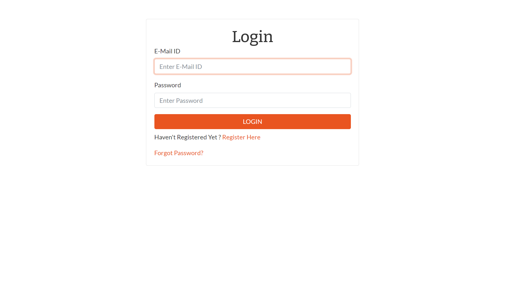
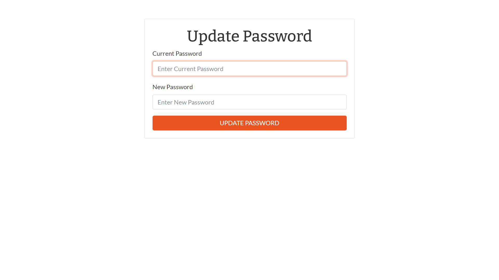
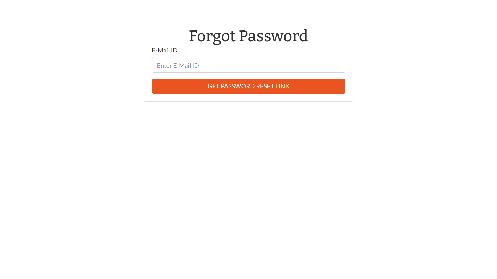
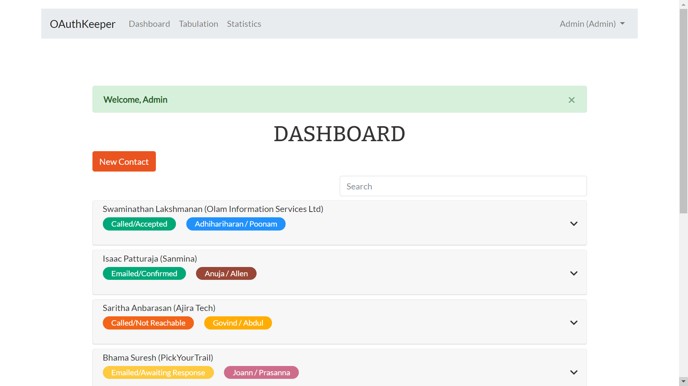
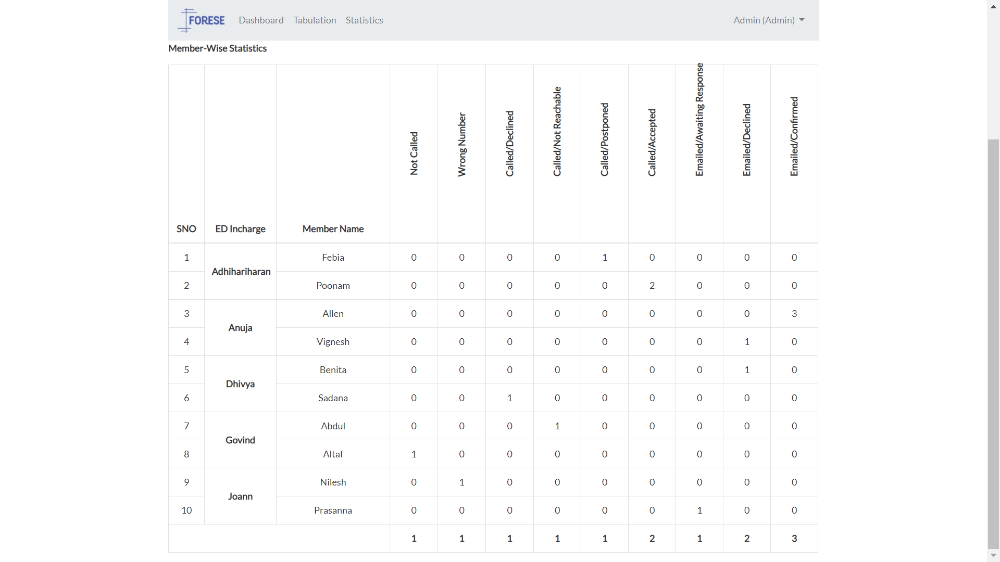
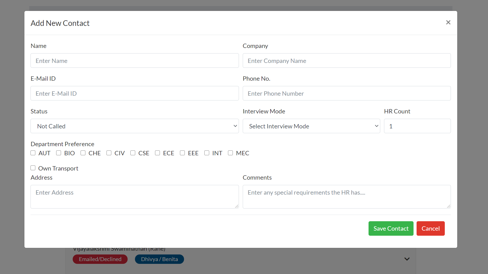
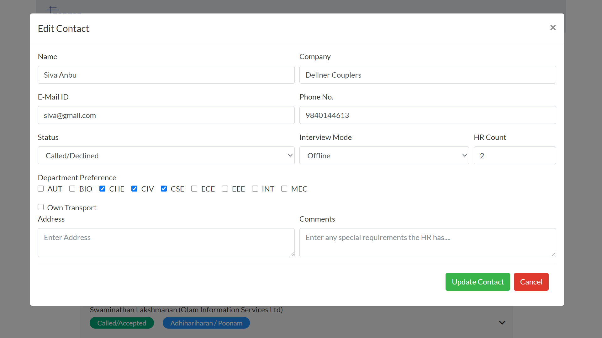
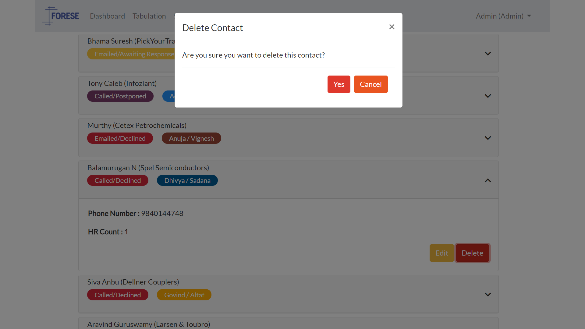

# OAuthKeeper

A simple yet functional REST application to manage HR contacts for MOCK PLACEMENTS (2021). It lets only authorized users to view certain contacts. Built with __NodeJS, Express, Mongoose and EJS__. Deployed to __Heroku__.

## Contents
- [Motivation](#motivation)
- [Features](#features)
- [Project Setup](#project-setup)
- [Database Seeder](#database-seeder)
- [Project Structure](#project-structure)
- [Screenshots](#screenshots)
- [Tools and Technologies](#tools-and-technologies)
- [Contributors](#contributors)
- [Contributing](#contributing)
- [LICENSE](#license)

## Motivation
The Mock Placements is the annual flagship event of the __FORum for Economic Studies for Engineers__, the placement club at SVCE. The objective of this event is to provide students with information about their strengths and weaknesses before they attend actual campus placements and job interviews. This is achieved by conducting aptitude tests, group discussion and mock interviews with _real_ HR's, giving the students some experience on how the process works. Inviting HR's to the college is one of the most important steps in the organizational process. This is done by letting specific students call and invite recruiters for the event.

However, this process can be chaotic and is inherently prone to problems. Some of the problems that were faced by the organisers are as follows:-

* A member would accidentally call contacts that had already been invited by other students. This results in overlapping of contacts. This leads to HRs and recruiters getting annoyed by getting calls from multiple students.
* Making note of the statuses of HRs for the event (Confirmed, Rejected, Awaiting Response, etc) was hard for students as they would have to note it all down somewhere. This would make it hard for the organisers to keep track of the number of HRs coming for the event and their details.
* The organizers were not able to maintain a proper count of the number of HR's who had been invited and this led to confusions among different teams responsible for organizing the event.

There was a need for a solution which would help us get solve all of these problems and hece we built this application.

## Features

### Members Accounts
* Members who are assigned the task of calling the HR's will have to sign up for an account using their E-Mail ID. The members would then be split into 5 teams, with each team being managed by an Executive Director (ED).
* Members would then have the option of adding contacts to the database, provided the HR contact does not already exist in the database. This is taken care of by the solution.
* Members can also update information of contacts that are visible to them such as name, company, number, email, address and, most importantly, status.
* Members can also search and filter contacts on the basis of status and interview mode (Online and Offline) which would help them keep of track of their progress.

### ED Accounts
* ED's can register and then log into their account to view the contacts added to the database by the students in their team only.
* There are also features which help the ED's to search for and filter contacts based on member-in-charge, status and interview mode.
* ED's can also view statistics on the number of HRs in each stage (such as 'Not Called', 'Confirmed', etc etc).
* ED's can also generate Excel and PDF files of the data present in the database.

### Administrator Accounts
* Admins enjoy the same privelages as that of the ED accounts and can view all the contacts, and not just the contacts of a particular team.
* An administrator account can be setup only by manually changing the role of a user to "Admin" in the database. 

### User Features
* All users who register on the site will have to verify their e-mail by clicking on the confirmation link sent to their mail.
* A logged in user can update their password by entering their current password and then creating a new one.
* Incase a user forgots his/her password, they can reset it by requesting for a password reset link to be sent to their e-mail..

## Project Setup

Rename the .env.example file to .env and replace it with your credentials.

To get a SendGrid API key, signup for a SendGrid account [here](https://sendgrid.com/).

```
Install dependencies
npm install

Run in development mode
npm run dev

Run in production mode
npm start
```

## Database Seeder 

```
Destroy All Data
node seeder -d

Import All Data
node seeder -i
```

## Project Structure

```
OAuthKeeper2.0/
  .git                   # Git Source Directory
  node_modules/          # Project Dependencies
  config/                # Database connection helper
  controllers/           # User and Contact controller methods
  middleware/            # Middleware functions
  models/                # Database Schemas and Models
  public/                # Static CSS, JS files and Favicon
  resources/             # Project Specifications and seed data
  routes/                # User and Contact routes
  screenshots/           # Screenshots for documentation
  utils/                 # Log Files and other utilities
  views/                 # EJS Views and Partials
  .env                   # Environment Variables
  .gitignore             # Files and folders to be ignored
  app.js                 # Express configuration
  server.js              # Application entry point
  seeder.js              # Seed file to populate and destroy data
  package.json           # Project Description and dependencies
  package-lock.json      # Lock File
  LICENSE                # MIT License file
  README.MD              # Brief documentation
```

## Screenshots
| Register Page                        | Login Page                           | Update Password Page                          | 
| ------------------------------------ | ------------------------------------ | --------------------------------------------- | 
|  |     |    | 

| Forgot Password Page                        |  Dashboard                            | Statistics
| ------------------------------------------- | ------------------------------------- | ------------------------------------- |
|  |  | 

| Create Contact                             | Update Contact                              | Delete Contact                           |
| ------------------------------------------ | ------------------------------------------- | ---------------------------------------- |
|  |  | 

## Tools And Technologies
* [Visual Studio Code](https://code.visualstudio.com/)
* [NodeJS](https://nodejs.org/en/)
* [NPM](https://www.npmjs.com/)
* [MongoDB Atlas](https://www.mongodb.com/cloud/atlas)

## Contributors
* Design and Development - [Nilesh D](https://github.com/Nilesh2000)
* Inputs - Adhihariharan, Dhivya, Joann

## Contributing
Please feel free to fork, comment, critique, or submit a pull request.

## LICENSE
This project is open source and available under the [MIT License](https://github.com/ForeseTech/OAuthKeeper2.0/tree/master).
